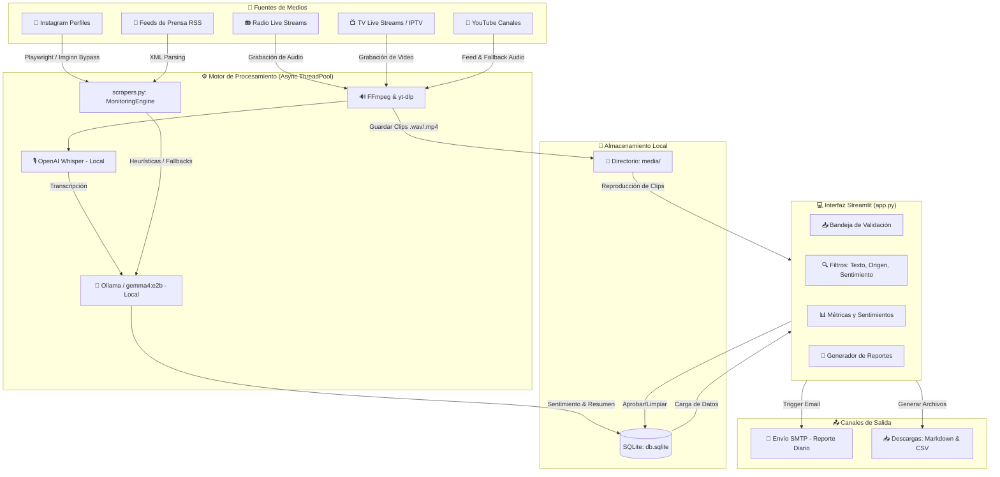

# 📝 Documentación del Sistema: War Room de Monitoreo de Medios con IA

Esta documentación detalla la arquitectura, el diseño técnico, las fuentes de monitoreo y los procedimientos de despliegue del sistema **War Room - Monitoreo de Medios con Inteligencia Artificial**. Este tablero web premium permite capturar, clasificar y reportar menciones críticas en tiempo real desde múltiples canales analógicos y digitales, operando de forma 100% local y asíncrona.

---

## 📊 Diagrama de Arquitectura del Sistema

El siguiente diagrama ilustra el flujo de información desde los medios de origen hasta la bandeja del operador y el reporte final enviado al cliente:

---

## 🛠️ Arquitectura de Archivos del Proyecto

El sistema está diseñado de forma modular y minimalista para evitar dependencias excesivas y facilitar su empaquetamiento:

| Archivo / Carpeta | Propósito / Descripción |
| :--- | :--- |
| **[app.py](file:///C:/Users/Danny/Documents/antigravity/wonderful-kepler/app.py)** | Interfaz gráfica e interactiva construida en Streamlit. Maneja el diseño premium del dashboard, los filtros de la bandeja de entrada, el gráfico de métricas y la bitácora en vivo. |
| **[scrapers.py](file:///C:/Users/Danny/Documents/antigravity/wonderful-kepler/scrapers.py)** | Motor de monitoreo concurrente (`ThreadPoolExecutor`). Controla la lógica de descarga, grabación, transcripción (Whisper) y clasificación con IA (Ollama). |
| **[database.py](file:///C:/Users/Danny/Documents/antigravity/wonderful-kepler/database.py)** | Capa de persistencia en SQLite (`db.sqlite`). Almacena el historial de contenidos procesados, el estado de las alertas (`pending`/`approved`) y la configuración persistente del sistema. |
| **[requirements.txt](file:///C:/Users/Danny/Documents/antigravity/wonderful-kepler/requirements.txt)** | Lista de dependencias de Python optimizadas y fijadas para la versión 3.11+. |
| **[setup.bat](file:///C:/Users/Danny/Documents/antigravity/wonderful-kepler/setup.bat)** | Script de instalación automática de dependencias para entornos Windows en un solo clic. |
| **[run.bat](file:///C:/Users/Danny/Documents/antigravity/wonderful-kepler/run.bat)** | Script ejecutable para arrancar el servidor de Ollama y el panel de Streamlit simultáneamente. |
| **ffmpeg.exe** | Binario ejecutable estático de FFmpeg, empaquetado para procesar streams y conversiones multimedia. |
| **📂 media/** | Carpeta local donde se almacenan físicamente los clips de audio y video capturados. |

---

## 🎙️ Módulos de Captura y Monitoreo

### 1. 📻 Monitoreo de Radio en Vivo
- **Mecanismo**: El motor de radio lee la URL de streaming configurada. Ejecuta un subproceso de `ffmpeg` para capturar un clip de audio de 30 segundos en formato `.wav`.
- **Procesamiento**: El audio se convierte a 16kHz mono (requisito de Whisper) y se transcribe de forma local. Si coincide con alguna de las palabras clave, se envía a Ollama para su clasificación.
- **Reproductor Local**: Las alertas de radio en la bandeja incluyen un botón desplegable nativo para reproducir el clip de audio de forma interactiva en la página web.

### 2. 📺 Monitoreo de Televisión (TV)
- **Mecanismo**: El scraper de TV utiliza `yt-dlp` para resolver transmisiones en vivo (como YouTube Live o IPTV `.m3u8`) y graba un fragmento de video de 20 segundos.
- **Optimización**: Para no saturar el almacenamiento, el clip de video se comprime dinámicamente usando el códec H.264 con configuraciones veloces (`-preset ultrafast -crf 28`).
- **Reproductor Integrado**: La alerta incluye un reproductor interactivo `st.video` para visualizar el clip directamente sin salir del dashboard.

### 3. 🎥 Raspador de YouTube
- **Búsqueda Eficiente**: Escanea los últimos 25 videos de los canales objetivo.
- **Detección de Transcripciones**: Intenta obtener las transcripciones automáticas nativas en español mediante API para ahorrar ancho de banda.
- **Fallback con Whisper**: Si el canal tiene bloqueadas las transcripciones nativas o si la IP del servidor es bloqueada temporalmente por YouTube, el sistema descarga automáticamente el audio del video con `yt-dlp`, lo convierte a WAV y lo transcribe localmente usando Whisper en CPU/GPU.
- **Enfriamiento Inteligente**: Si el video más reciente del canal ya fue procesado, activa un **enfriamiento de 1 hora** en la base de datos para no saturar de peticiones a YouTube. Además, procesa un máximo de 2 videos por ciclo para evitar bloqueos del sistema.

### 4. 📸 Raspador de Instagram
- **Bypass de Bloqueo**: Instagram implementa muros de inicio de sesión estrictos. El sistema cuenta con dos vías de acceso:
  1. **Bypass Público (Imginn)**: Si Playwright es bloqueado, redirige de forma transparente el scraping a un visor público (Imginn), extrayendo el contenido y los shortcodes en milisegundos sin requerir cuentas.
  2. **Cookie de Sesión (`sessionid`)**: El operador puede pegar la cookie de su cuenta en la barra lateral para permitir un rastreo directo y nativo sobre perfiles privados o públicos a través de intercepción de GraphQL.
- **Límite**: Monitorea de forma fija los **últimos 16 posts** del feed de los usuarios especificados.

### 5. 📰 Filtro de Feeds de Prensa RSS
- **Mecanismo**: Descarga de forma ligera y rápida los feeds XML de portales de noticias (ej: Somos Pueblo).
- **Procesamiento**: Compara el título y la descripción con las palabras clave. Utiliza funciones hash de los enlaces para descartar instantáneamente artículos duplicados ya procesados en la base de datos.

---

## 🤖 Integración del Cerebro de Inteligencia Artificial (Local)

El sistema opera bajo una política estricta de privacidad. Ningún dato de monitoreo sale del servidor del cliente hacia APIs externas:

1. **OpenAI Whisper (Model: `tiny` / `base`)**:
   - **Carga Local**: Se ejecuta 100% offline mediante la librería `whisper`.
   - **Procesamiento de Voz**: Transcribe los flujos grabados de Radio, TV y audios descargados en fallbacks de YouTube.
   - **Limitación de Hilos de CPU**: Para evitar congelamientos del servidor Streamlit y del WebSocket (`WinError 10054`), se restringe el paralelismo de CPU de PyTorch a un solo hilo (`torch.set_num_threads(1)`).
   - **Sincronización por Bloqueo Global (`_whisper_transcription_lock`)**: Se utiliza un bloqueo exclusivo para serializar la transcripción. Múltiples fuentes graban simultáneamente, pero transcriben secuencialmente (una por una) para evitar picos de consumo de CPU al 100%.
2. **Ollama (`gemma4:e2b`)**:
   - Ejecuta un servidor local en el puerto `11434`.
   - **Clasificación de Sentimientos**: Identifica si una mención es `🟢 Positivo`, `🔵 Neutral` o `🔴 Negativo`.
   - **Resumen en una línea**: Sintetiza discursos extensos de radio o TV en una sola oración concisa para su visualización rápida en las tarjetas.
   - **Síntesis Ejecutiva Consolidada**: Analiza todas las menciones aprobadas de la sesión de trabajo y redacta un reporte de tendencias ejecutivo en tono corporativo formal.
   - **Control de Timeout**: Cuenta con un tiempo de espera de 10 segundos. Si Ollama no responde o el servicio está apagado, se activa un motor heurístico de respaldo basado en reglas léxicas para evitar la parálisis de la bandeja.

---

## 📥 Bandeja de Validación y Filtros Avanzados

La bandeja de validación es el panel central de control del operador:

- **Buscador de Texto**: Permite filtrar las alertas ingresando una palabra o frase clave. El filtrado se realiza en tiempo real sobre el texto original, el resumen de la IA y el nombre del canal.
- **Filtro de Medios**: Selector multiselección para mostrar/ocultar fuentes (Radio, TV, YouTube, RSS, Instagram).
- **Filtro de Sentimiento**: Permite aislar rápidamente menciones según su impacto emocional.
- **Gestión de Estados**: Al pulsar **Aprobar**, la alerta se marca en la base de datos como `'approved'` y pasa a formar parte del reporte acumulado del día.

---

## 📧 Módulo SMTP y Reportes Consolidados

El panel **Generador de Reportes** permite exportar el trabajo del operador y enviarlo directamente a la gerencia:

- **Configuración Persistente**: Los datos del servidor de correo se configuran en una sección colapsable en la barra lateral y se guardan como JSON seguro en SQLite para persistir tras apagados del sistema.
- **Diagnóstico Rápido**: El botón "🧪 Probar Conexión" valida los puertos, usuario y contraseña enviando un correo de prueba de 1 línea al destinatario.
- **Envío en Segundo Plano (Asíncrono)**: El envío del reporte completo se realiza en un hilo separado de Streamlit. El usuario ve un indicador de "Enviando..." mientras sigue operando la bandeja con normalidad.
- **Archivos Adjuntos**:
  - **Reporte Markdown (`.md`)**: Contiene la síntesis consolidada de IA, métricas de cobertura y el desglose de menciones. Para las alertas de radio y TV, incorpora enlaces HTTPS en la nube (Catbox) y **audio codificado en Base64** embebido para reproducción offline en cualquier dispositivo.
  - **Reporte Excel/CSV (`.csv`)**: Tabla de datos estructurada con las columnas analíticas de fecha, fuente, texto, resumen, sentimiento y links de clips multimedia.

---

## 👥 Arquitectura Multi-Cliente con IA y Reportes Personalizados

El sistema War Room permite gestionar de manera simultánea e independiente múltiples clientes o marcas. Esto permite segmentar las palabras clave de búsqueda, los destinatarios de los reportes y el enfoque del análisis con Inteligencia Artificial.

### 1. Modelo de Datos SQLite
- **Tabla `clients`**: Almacena de forma persistente los perfiles de los clientes, compuestos por su nombre, correos de envío de reportes, palabras clave de monitoreo y descripción contextual para la IA.
- **Tabla `alerts` con `client_id`**: Cada alerta se vincula a un ID de cliente específico. La restricción única `UNIQUE(client_id, identifier)` permite duplicar una mención relevante para diferentes clientes, de forma que cada operador la gestione de manera autónoma en su bandeja de entrada.
- **Seeding Automático**: Se incluye un cliente semilla por defecto ("Cliente General") para asegurar el funcionamiento out-of-the-box del sistema.

### 2. Unificación y Enrutamiento del Motor
- **Unión de Palabras Clave Activas**: En cada ciclo de escaneo, se compila un conjunto unificado con las palabras clave únicamente de los clientes habilitados (`enabled == 1`). Los clientes desactivados se omiten por completo de la búsqueda para optimizar recursos.
- **Enrutamiento y Filtrado per-cliente**: Al detectarse una mención, se evalúa contra las palabras clave específicas de cada cliente activo. Si coincide, se crea una alerta vinculada a su `client_id`.
- **Protección de Fallback**: Si una mención no coincide de manera exacta y se asigna al primer cliente activo como respaldo, la alerta se filtra para que contenga únicamente las palabras clave que correspondan al cliente receptor, bloqueando la filtración de palabras clave pertenecientes a clientes inactivos.

### 3. Panel de Administración de Clientes y Filtros
- **Dropdown de Cliente Activo**: Se renderiza al principio del panel central de Streamlit. Al cambiar de cliente, se filtran de forma reactiva las alertas en bandeja, métricas de sentimiento y el generador de reportes.
- **Pestaña 👥 Clientes**: Panel integrado para visualizar la lista de clientes registrados, crear nuevos perfiles de cliente, editar datos de perfiles existentes o eliminar clientes (protegido contra eliminación si solo queda un cliente activo).
- **Análisis de IA Personalizado**: La descripción contextual del cliente activo se inyecta en el prompt enviado a Ollama local (`gemma4:e2b`), permitiendo orientar los resúmenes y reportes según el tono y las necesidades analíticas específicas de la marca.
- **Destinatarios SMTP por Cliente**: El envío de correo diario se direcciona de manera automática a la lista de destinatarios configurada para el cliente activo, cayendo de vuelta en el remitente SMTP general de la barra lateral si el cliente no posee correos asignados.

---

## ⚙️ Despliegue e Instalación en Clientes

El sistema incluye scripts automatizados diseñados para Windows:

### 1. Instalación Inicial (`setup.bat`)
El operador debe ejecutar el archivo `setup.bat` (preferiblemente como Administrador) en la máquina de destino. El script realiza lo siguiente de forma desatendida:
1. Verifica e instala de forma silenciosa la versión adecuada de Python.
2. Crea el entorno virtual local (`venv`).
3. Instala todas las dependencias listadas en `requirements.txt`.
4. Descarga los navegadores headless requeridos por Playwright.
5. Ejecuta la instalación silenciosa de Ollama (`OllamaSetup.exe /silent`).
6. Inicia temporalmente Ollama para descargar localmente el modelo `gemma4:e2b`.

> [!WARNING]
> **Permisos de Antivirus**: Algunos antivirus restrictivos en Windows pueden bloquear la ejecución de scripts `.bat` o la descarga de los binarios de Playwright/Ollama. En tal caso, se recomienda añadir una excepción para la carpeta del proyecto.

### 2. Ejecución Diaria (`run.bat`)
Para arrancar el sistema, el operador simplemente debe hacer doble clic en `run.bat`. Este script se encarga de:
1. Comprobar e iniciar el servicio local de Ollama en segundo plano (si no estuviese corriendo).
2. Verificar la integridad del entorno virtual (`venv/Scripts/activate.bat`) de forma lineal externa (evitando bloques de paréntesis conflictivos para CMD en Windows).
3. Activar el entorno virtual local (`venv`).
4. **Bucle de Auto-Recuperación (Auto-Restart)**: Arranca el servidor web de Streamlit e inicia el navegador en `http://localhost:8501`. En caso de que el proceso del servidor falle o se cierre de forma inesperada, el script espera 5 segundos y vuelve a lanzar Streamlit automáticamente en un bucle infinito, asegurando una alta disponibilidad.

---

## 🛠️ Guía de Solución de Problemas (Troubleshooting)

### El script `setup.bat` se cierra inmediatamente al abrirse
* **Causa**: Versiones antiguas de CMD en Windows tienen problemas para parsear caracteres especiales dentro de bloques lógicos.
* **Solución**: Este error fue corregido en el script eliminando los bloques delimitados por paréntesis conflictivos. Si persiste, ejecute el script desde una ventana de PowerShell abierta manualmente: `.\setup.bat`.

### El Diagnóstico de Ollama muestra `❌ N/A` en la barra lateral
* **Causa**: El servicio local de Ollama no se está ejecutando o no ha terminado de cargar.
* **Solución**: Abra una terminal en Windows y ejecute `ollama list` para verificar que el servicio responda. Asegúrese de que el modelo esté descargado corriendo `ollama run gemma4:e2b` en la consola.

### No se capturan alertas reales de Instagram
* **Causa**: Instagram ha bloqueado temporalmente la dirección IP pública por exceso de consultas.
* **Solución**: Pegue la cookie `sessionid` de una cuenta activa en el campo correspondiente en la barra lateral, o asegúrese de que el sistema esté alternando correctamente al visor público Imginn.

### La bandeja de alertas tarda demasiado en cargar
* **Causa**: Se han acumulado cientos de archivos multimedia en la base de datos local.
* **Solución**: Diríjase a la barra lateral, expanda la sección **Mantenimiento** y haga clic en **`🧹 Resetear Caché y Enfriamientos`** para restablecer el historial procesado y desaturar el motor de base de datos.
